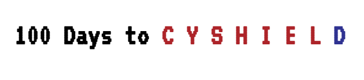

# 100 Days to Cyshield
A 100 Days Challenge to work in Cyshield, where I create vulnerable website functionalities and know know the vulnerability cause then fix it and deploy it.

You'll find two versions of each challenge:
======================================================================
One found in 'vulnerable' directory which is Vulnerable for sure.
Second one found in 'secure' directory which is Secure xD.
